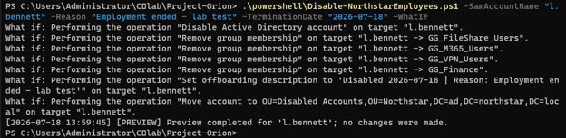
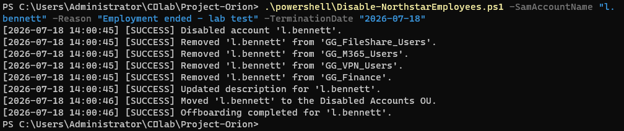

# 🚀 Project Orion

> Enterprise Hybrid Identity & Access Management Home Lab


---

# Overview

Project Orion is an enterprise-style Identity and Access Management (IAM) home lab designed to simulate how organizations manage identities throughout the employee lifecycle.

This project demonstrates Active Directory administration, Role-Based Access Control (RBAC), PowerShell automation, identity governance, and hybrid identity concepts using a realistic enterprise environment.

The goal is to build a portfolio that reflects real-world IAM engineering practices rather than isolated tutorials.

---

# Lab Environment

| Component | Technology |
|-----------|------------|
| Hypervisor | Oracle VirtualBox |
| Server | Windows Server 2025 |
| Directory Services | Active Directory Domain Services |
| DNS | Windows DNS |
| Automation | PowerShell |
| Version Control | Git & GitHub |
| Future Integration | Microsoft Entra ID |

---

# Current Progress

- ✅ Windows Server 2025 deployed
- ✅ Active Directory Domain Services installed
- ✅ Domain Controller promoted
- ✅ Enterprise OU structure created
- ✅ Department security groups created
- ✅ Sample users created
- ✅ CSV-driven user provisioning
- ✅ Automated RBAC and access assignment
- ✅ Automated employee offboarding
- 🚧 Joiner-Mover-Leaver lifecycle automation
- ⏳ Hybrid Microsoft Entra ID

---

# Repository Structure

```text
Project-Orion
│
├── data
├── diagrams
├── docs
├── powershell
├── screenshots
└── README.md
```
# 🌑 Automated Employee Offboarding

Project Orion includes a PowerShell-driven leaver workflow that securely removes access when an employee leaves Northstar Aerospace Systems.

The workflow:

- Locates employees by `SamAccountName`
- Blocks built-in and privileged administrator accounts
- Supports safe validation with `-WhatIf`
- Disables the Active Directory account
- Removes all non-default security-group memberships
- Preserves the required `Domain Users` membership
- Records the termination date and reason
- Moves the account into the `Disabled Accounts` OU
- Logs completed actions for review

## Validation Evidence

### Safe Preview



*PowerShell `-WhatIf` preview of account disablement, access removal, description updates, and OU relocation.*

### Successful Execution



*Successful automated offboarding of a non-privileged lab account.*

### Post-Offboarding Verification


*Validation confirming the account is disabled, documented, relocated, and retains only its default domain membership.*
---

# Project Roadmap

## Phase 1
- [x] Install Windows Server
- [x] Deploy Active Directory
- [x] Create Enterprise OU Structure
- [x] Implement Department Security Groups

## Phase 2
- [x] Automated User Provisioning
- [x] CSV Import Automation
- [x] Automated Group Membership

## Phase 3
- [ ] Joiner Process
- [ ] Mover Process
- [x] Leaver Process

## Phase 4
- [ ] Active Directory Auditing
- [ ] Identity Governance Reports
- [ ] Microsoft Entra ID Integration

---

# Skills Demonstrated

- Active Directory Administration
- Identity & Access Management
- RBAC Design
- PowerShell Automation
- Windows Server Administration
- DNS Administration
- Git & GitHub Documentation

---

## Author

Built by Devian Eddins as part of an Identity & Access Management portfolio.