# 🚀 Project Orion

> Enterprise Hybrid Identity & Access Management Home Lab


---

# Overview

Project Orion is an enterprise-style Identity and Access Management (IAM) home lab designed to simulate how organizations manage identities throughout the employee lifecycle.

This project demonstrates Active Directory administration, Role-Based Access Control (RBAC), PowerShell automation, identity governance, and hybrid identity concepts using a realistic enterprise environment.

The goal is to build a portfolio that reflects real-world IAM engineering practices rather than isolated tutorials.

---

# Lab Environment

| Component | Technology |
|---|---|
| Hypervisor | Oracle VirtualBox |
| Server | Windows Server 2025 |
| Directory Services | Active Directory Domain Services |
| DNS | Windows DNS |
| Automation | PowerShell |
| Version Control | Git & GitHub |
| Cloud Identity | Microsoft Entra ID |
| Sync Server | Windows Server 2022 |

---

# Current Progress

- ✅ Windows Server 2025 deployed
- ✅ Active Directory Domain Services installed
- ✅ Domain controller promoted
- ✅ Enterprise OU structure created
- ✅ Department security groups created
- ✅ Sample users created
- ✅ CSV-driven user provisioning
- ✅ Automated RBAC and access assignment
- ✅ Automated employee offboarding
- ✅ Automated employee transfer workflow
- 🚧 Joiner-Mover-Leaver lifecycle automation
- ⏳ Hybrid Microsoft Entra ID

---

# Repository Structure

```text
Project-Orion
│
├── data
├── diagrams
├── docs
├── logs
├── powershell
├── screenshots
└── README.md
```

---

# 🌑 Automated Employee Offboarding

Project Orion includes a PowerShell-driven leaver workflow that securely removes access when an employee leaves Northstar Aerospace Systems.

The workflow:

- Locates employees by `SamAccountName`
- Blocks built-in and privileged administrator accounts
- Supports safe validation with `-WhatIf`
- Disables the Active Directory account
- Removes all non-default security-group memberships
- Preserves the required `Domain Users` membership
- Records the termination date and reason
- Moves the account into the `Disabled Accounts` OU
- Logs completed actions for review

## Validation Evidence

### Safe Preview


*PowerShell `-WhatIf` preview of account disablement, access removal, description updates, and OU relocation.*

### Successful Execution


*Successful automated offboarding of a non-privileged lab account.*

### Post-Offboarding Verification

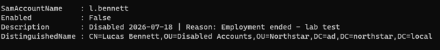

*Validation confirming the account is disabled, documented, relocated, and retains only its default domain membership.*

---

# 🛰️ Automated Employee Transfers

Project Orion includes a PowerShell-driven Mover workflow for securely transferring employees between departments.

The workflow:

- Locates employees by `SamAccountName`
- Blocks disabled and privileged accounts
- Validates the destination OU and security group
- Supports safe testing with `-WhatIf`
- Removes the previous department group
- Adds the destination department group
- Updates the employee's department and title
- Moves the account into the destination OU
- Preserves approved baseline access for review
- Logs completed transfer actions

## Transfer Validation Evidence

### Pre-Transfer Account State

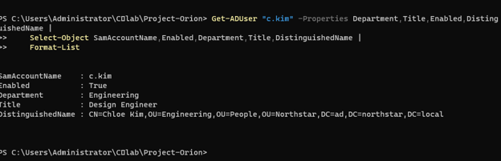

*Validation of the employee's original Engineering department, title, and OU placement.*

### Safe Transfer Preview

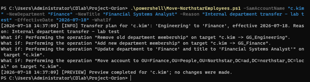

*PowerShell `-WhatIf` preview of department-group replacement, attribute updates, and OU relocation.*

### Successful Transfer

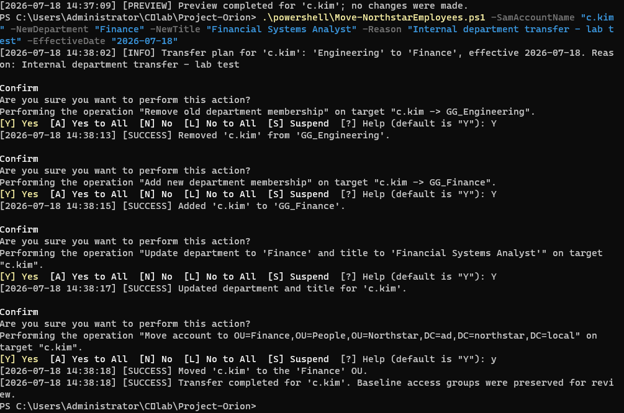

*Successful execution of the Engineering-to-Finance employee transfer.*

### Post-Transfer Verification

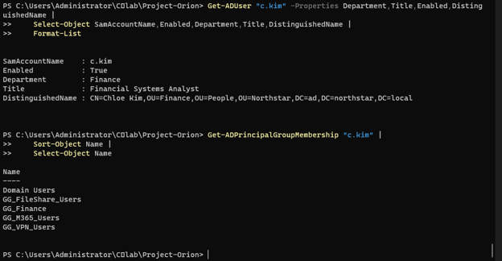

*Validation confirming the Finance department, updated title, correct OU placement, new department group, and preserved baseline access.*

---

## Identity and Access Audit

Project Orion includes a read-only PowerShell audit workflow that evaluates Active Directory identities for lifecycle inconsistencies, account-security risks, excessive access, and deviations from Northstar Aerospace Systems access standards.

### Audit Checks

The audit checks for:

- Disabled accounts retaining access
- Missing department attributes
- Missing job-title attributes
- Passwords configured to never expire
- Stale enabled accounts
- Enabled accounts with no recorded logon
- Missing department-group membership
- Department and OU mismatches
- Membership in multiple department groups
- Privileged-group membership
- Empty security groups
- Unrecognized department values

### Audit Workflow

The workflow:

- Retrieves users from the Northstar People OU
- Reviews account status and identity attributes
- Compares departments against approved group mappings
- Validates departmental OU placement
- Reviews department and privileged-group memberships
- Assigns severity levels to detected findings
- Exports detailed findings to CSV
- Records audit activity in a log file
- Performs no changes to Active Directory

### Initial Audit Results

| Metric | Result |
|---|---:|
| Users audited | 11 |
| Findings identified | 69 |
| Stale-account threshold | 90 days |
| Audit mode | Read only |
| Report format | CSV |

The initial finding count includes intentionally imperfect lab conditions, accounts without logon history, lifecycle inconsistencies created for testing, and empty security groups.

## Audit Validation Evidence

### Audit Script

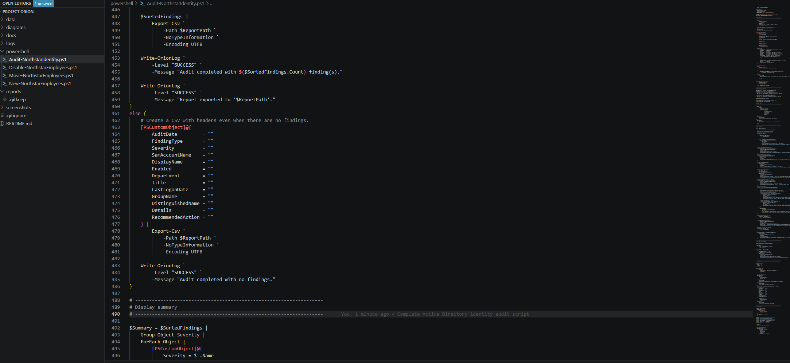

*PowerShell audit script configured to evaluate account status, attributes, group memberships, OU placement, stale accounts, privileged access, and other identity risks.*

### Successful Audit Execution

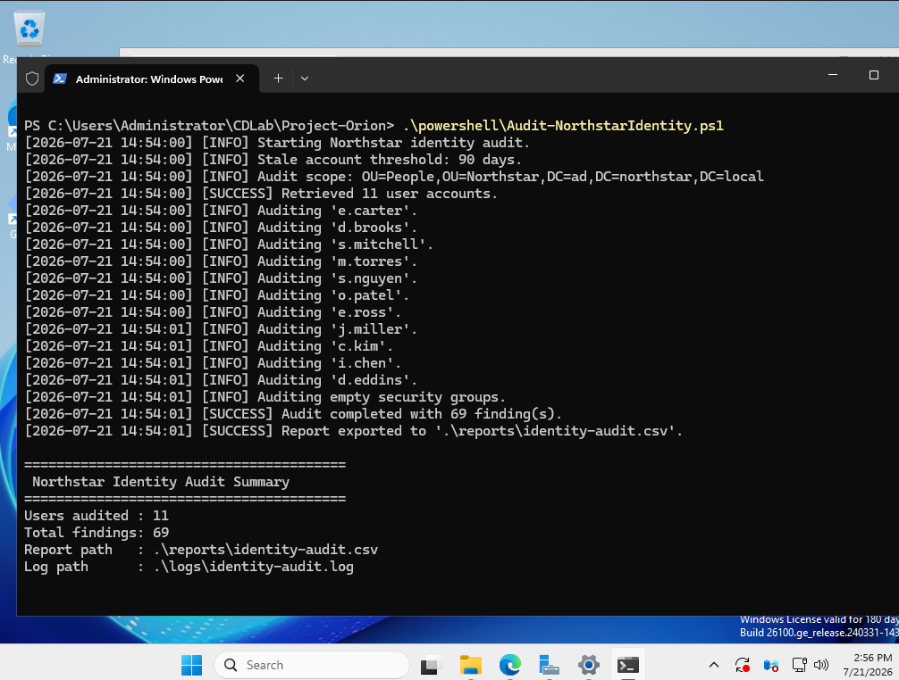

*Successful audit of 11 Northstar user accounts, resulting in 69 findings and the creation of a CSV report and execution log.*

### Generated Audit Files

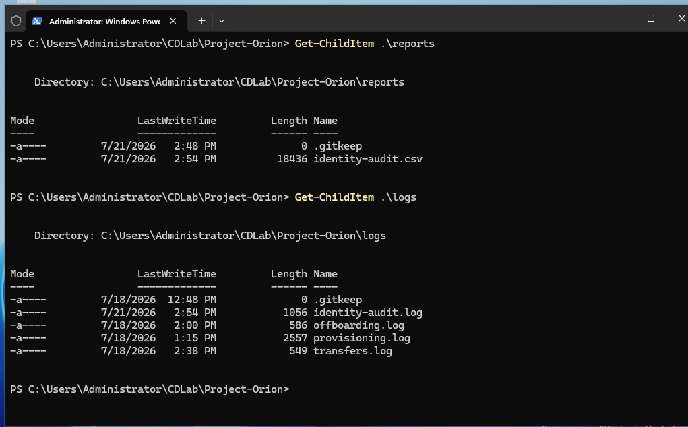

*Validation confirming that the identity audit report and audit log were generated successfully.*

### Identity Audit Findings

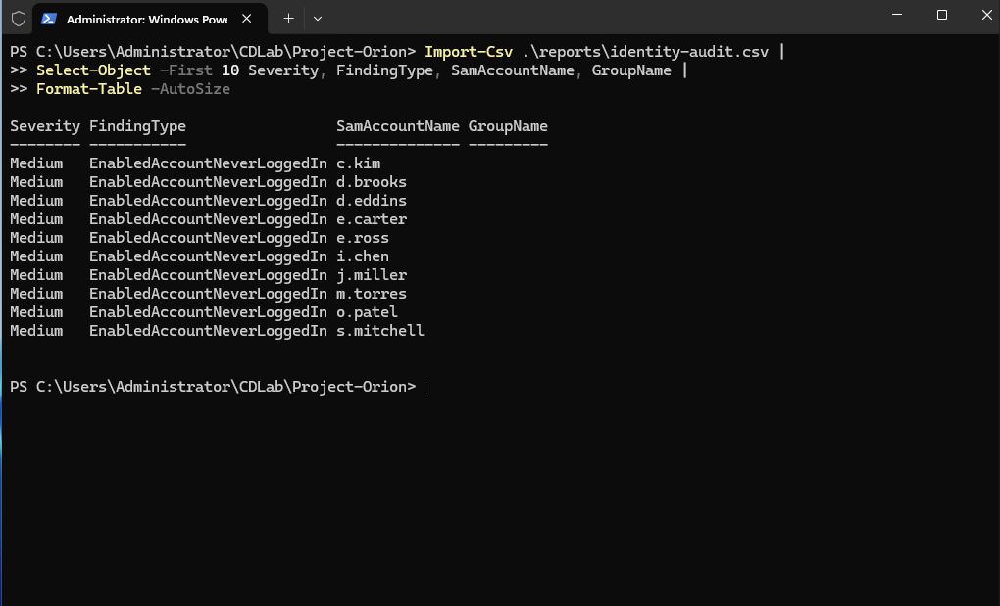

*Sample findings showing severity, finding type, affected account, related group, and detected identity or access issue.*

### Audit Severity Summary

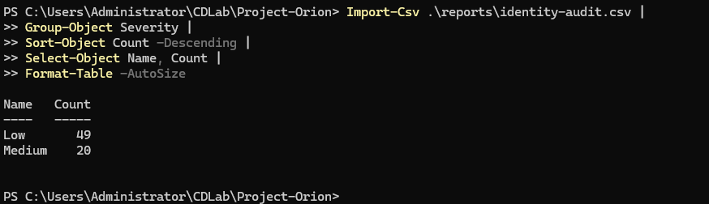

*Summary of audit findings grouped by severity to support risk-based review and remediation.*

### Governance Value

The audit workflow provides evidence that can support:

- Access certification campaigns
- Stale-account remediation
- Privileged-access reviews
- Disabled-account cleanup
- Least-privilege enforcement
- Identity-data quality reviews
- Compliance evidence collection
- Manager access reviews
---
---

## Access Certification and Remediation

Project Orion includes a PowerShell-driven access-certification workflow that exports Active Directory entitlements, records reviewer decisions, safely processes approved revocations, and verifies the resulting group memberships.

### Access Certification Workflow

The workflow:

- Exports direct security-group memberships
- Associates access with employee and manager information
- Classifies entitlements by access type and risk
- Provides `Approve` and `Revoke` decision fields
- Records reviewer names, comments, and review dates
- Preserves approved access
- Processes only explicitly approved revocations
- Protects administrative accounts and privileged groups
- Supports safe validation with `-WhatIf`
- Exports remediation results for governance evidence
- Verifies Active Directory membership after processing

### Access Review Export

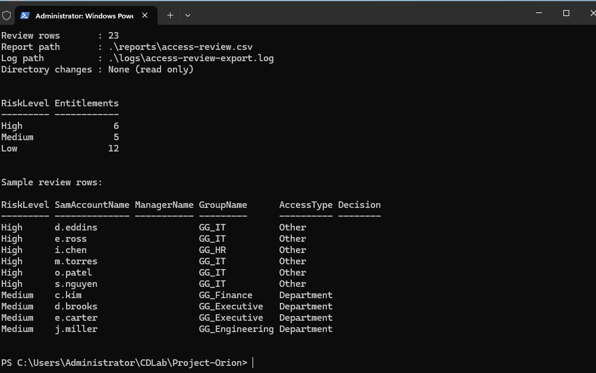

*Read-only export of Northstar user entitlements with identity, group, access-classification, and risk information.*

### Access Review Report

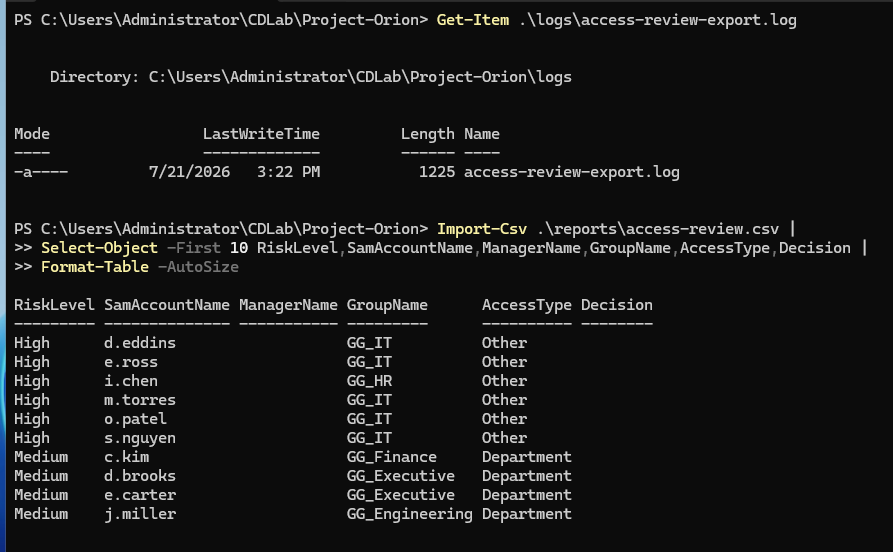

*Generated access-review report showing users, assigned groups, access types, risk levels, and reviewer-decision fields.*

### Reviewer Decisions

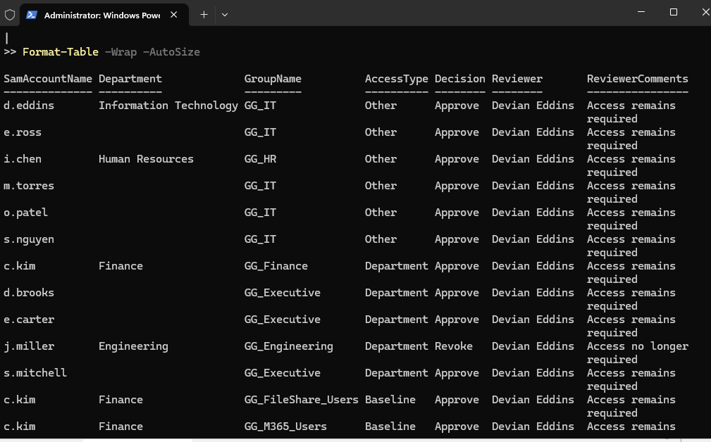

*Completed approval and revocation decisions with reviewer identity, comments, and review date.*

### Safe Remediation Preview

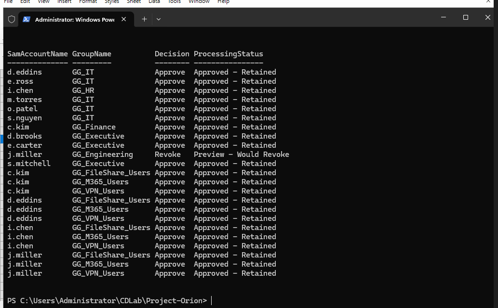

*PowerShell `-WhatIf` preview confirming that approved access will remain and selected access will be revoked without making directory changes.*

### Completed Remediation

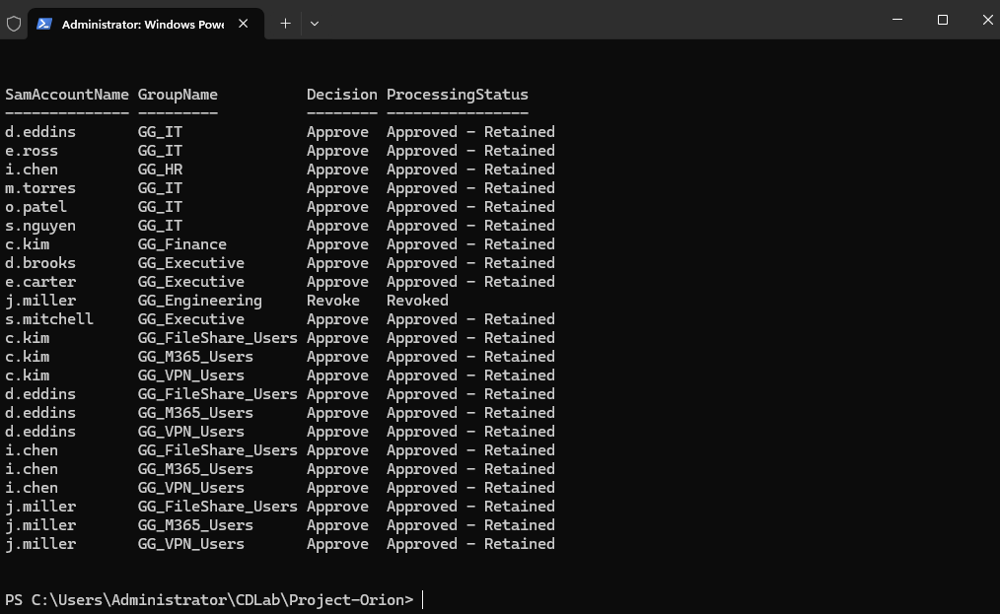

*Successful processing of the certification decisions, including approved-access retention and entitlement revocation.*

### Post-Remediation Verification

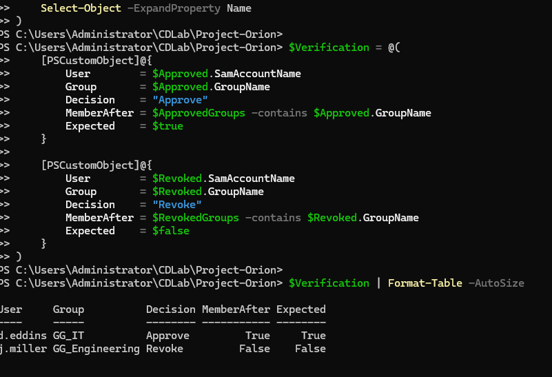

*Active Directory verification confirming that approved access remained assigned and revoked access was removed.*

### Security and Governance Value

This workflow demonstrates:

- Access certification
- Reviewer accountability
- Entitlement risk classification
- Approval and revocation decisions
- Least-privilege remediation
- Protected-account safeguards
- Safe change previews
- Post-remediation verification
- Governance audit trails

---

## Microsoft Entra Hybrid Identity Foundation

Project Orion extends the Northstar on-premises Active Directory environment into Microsoft Entra ID. This phase establishes the cloud tenant, separates administrative access, deploys a dedicated synchronization server, and configures a controlled pilot scope.

### Hybrid Identity Environment

| Component | Purpose |
|---|---|
| DC01 | Active Directory Domain Services and DNS |
| SYNC01 | Microsoft Entra provisioning agent |
| Microsoft Entra ID | Cloud identity directory |
| `ad.northstar.local` | On-premises Active Directory domain |
| `GG_CloudSync_Pilot` | Controlled pilot synchronization scope |

### Tenant Security Configuration

The Microsoft Entra tenant includes:

- Northstar Aerospace Systems tenant branding
- A dedicated cloud-administrator identity
- Global Administrator role validation
- Security Defaults enabled
- Multifactor authentication for administrative access
- Separation between personal and administrative identities

### Synchronization Infrastructure

The dedicated Windows Server 2022 synchronization server includes:

- Membership in `ad.northstar.local`
- DNS resolution through DC01
- Connectivity to Microsoft Entra endpoints
- Microsoft Entra provisioning agent
- A group managed service account
- Automatic agent-service startup
- A selected-security-group pilot scope

### Hybrid Identity Validation Evidence

#### Microsoft Entra Tenant

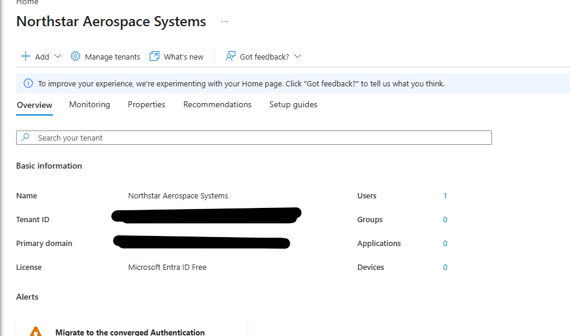

*Northstar Aerospace Systems tenant established in Microsoft Entra ID.*

#### Security Defaults

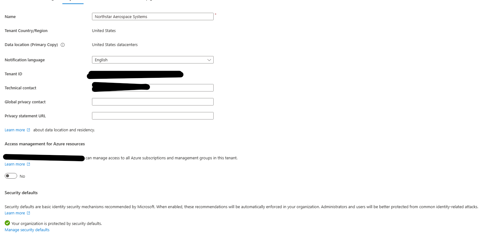

*Security Defaults enabled to provide baseline cloud identity protection.*

#### Dedicated Cloud Administrator

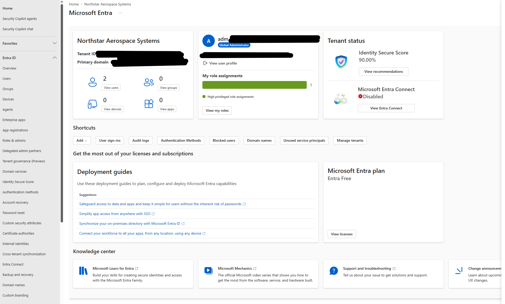

*Dedicated administrative identity configured separately from the personal tenant account.*

#### SYNC01 Domain Membership

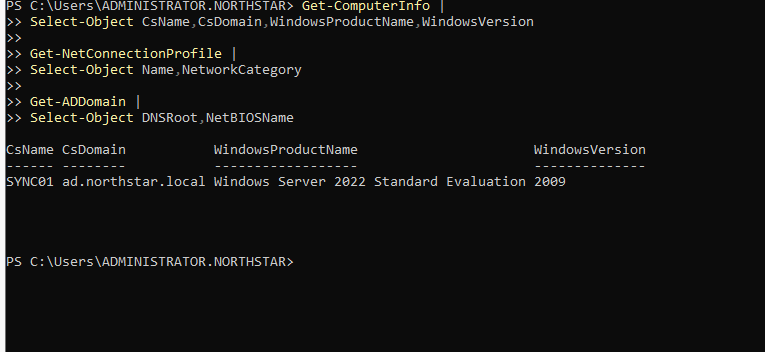

*Dedicated Windows Server 2022 synchronization server joined to `ad.northstar.local`.*

#### Provisioning Agent Service

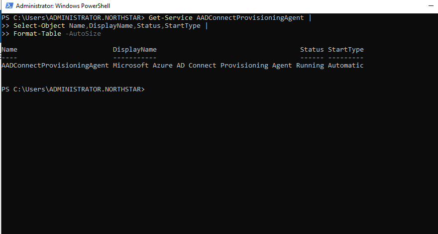

*Microsoft Entra provisioning-agent service installed on the dedicated synchronization server.*

#### Active Provisioning Agent

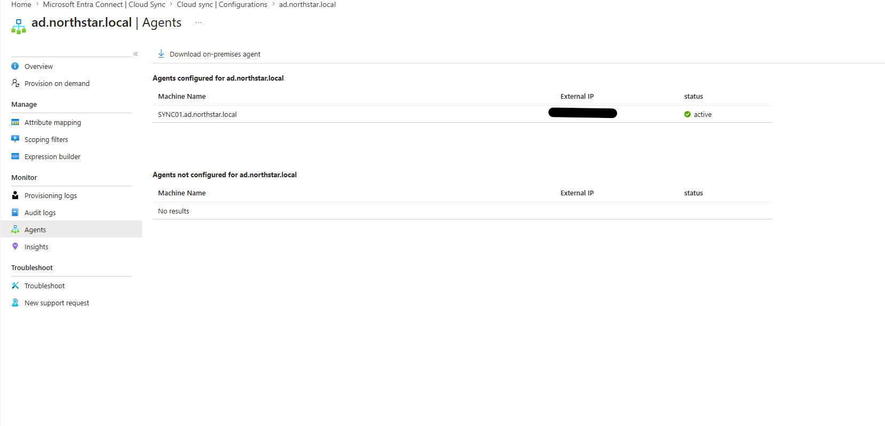

*SYNC01 registered as the active provisioning agent for `ad.northstar.local`.*

#### Pilot Synchronization Group

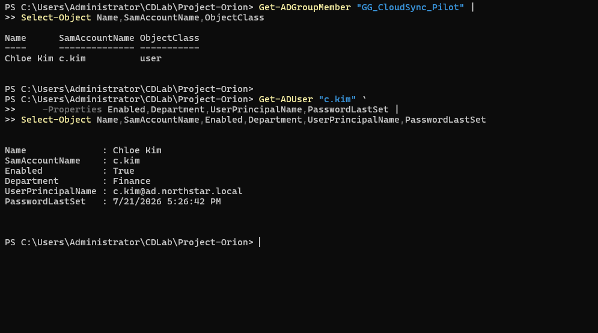

*Dedicated pilot security group limiting synchronization scope to the approved test identity.*

### Current Validation Status

The tenant, dedicated synchronization server, provisioning agent, and pilot scope have been established. End-to-end pilot-user synchronization remains under validation and will be documented separately after successful provisioning.

### Hybrid Identity Value

This phase demonstrates:

- Microsoft Entra tenant administration
- Administrative-account separation
- Baseline cloud identity security
- Dedicated synchronization infrastructure
- Group managed service accounts
- Group-scoped pilot deployment
- Hybrid identity troubleshooting
- Controlled rollout and validation practices


---

# Project Roadmap

## Phase 1 — Identity Foundation

- [x] Install Windows Server
- [x] Deploy Active Directory
- [x] Create enterprise OU structure
- [x] Implement department security groups

## Phase 2 — Automated Provisioning

- [x] Automate user provisioning
- [x] Import employee data from CSV
- [x] Automate department and access-group membership

## Phase 3 — Identity Lifecycle

- [x] Joiner process
- [x] Mover process
- [x] Leaver process

## Phase 4 — Governance and Hybrid Identity

- [x] Active Directory auditing
- [x] Identity governance reports
- [x] Microsoft Entra ID integration

## Phase 5 — Microsoft Entra Hybrid Identity

- [x] Microsoft Entra tenant foundation
- [x] Dedicated cloud administrator
- [x] Security Defaults
- [x] Dedicated SYNC01 server
- [x] Cloud Sync agent deployment
- [x] Pilot synchronization scope
- [ ] End-to-end pilot-user synchronization

---

# Skills Demonstrated

- Active Directory administration
- Identity and Access Management
- Role-Based Access Control design
- PowerShell automation
- Joiner-Mover-Leaver lifecycle management
- Windows Server administration
- DNS administration
- Git and GitHub documentation

---

## Author

Built by Devian Eddins as part of an Identity & Access Management portfolio.
